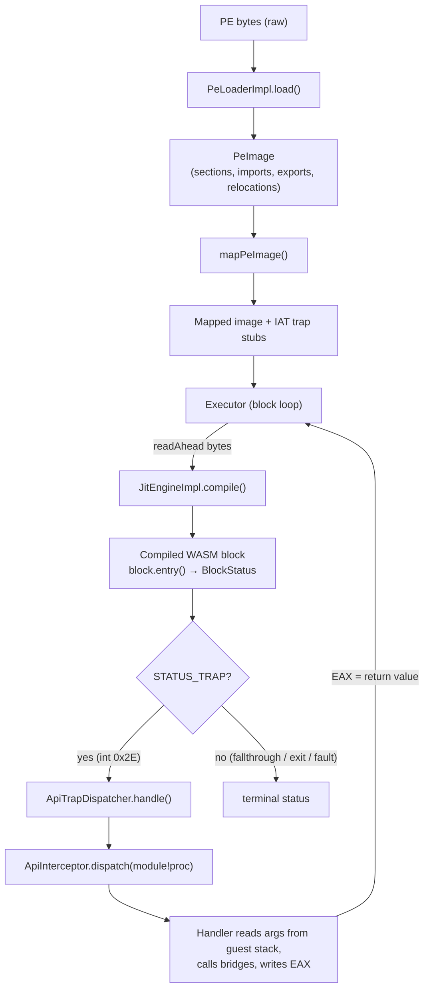
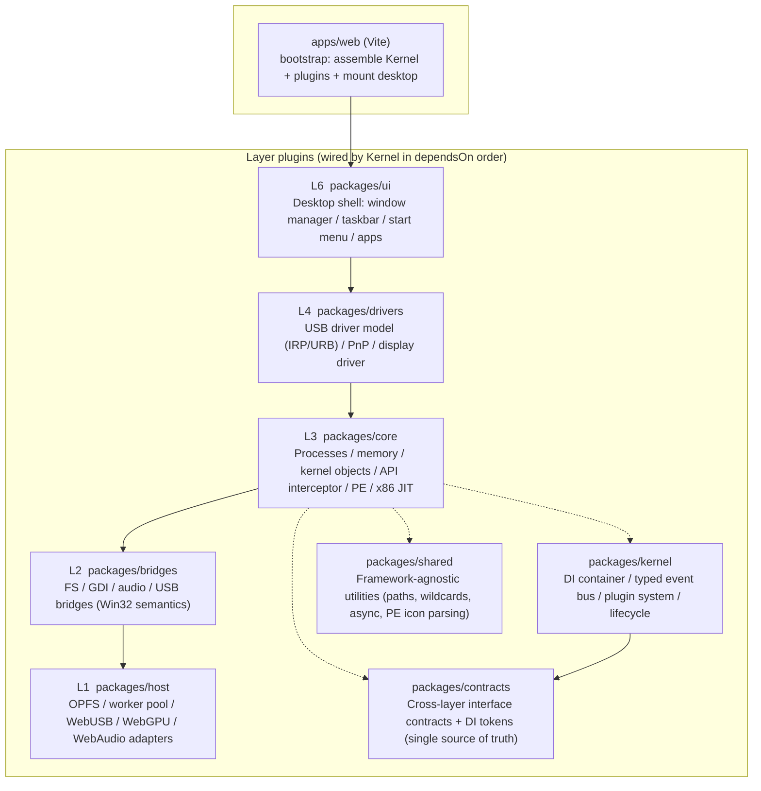
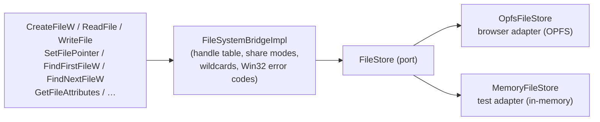

# SpecterCore

> Run real Windows x86 applications natively in the browser — emulating API surfaces, not hardware.

SpecterCore is a browser-based Windows compatibility layer that executes unmodified PE32 (and PE32+) binaries through an in-house **x86 → WebAssembly JIT**, intercepts their Win32 API calls via **trap-stub IAT rewriting**, and bridges them onto browser primitives (OPFS for the file system, WebUSB for devices, WebGPU for graphics, AudioWorklet for audio). It does not emulate any CPU hardware peripherals; instead it implements the Win32 API contract at the boundary, the same way Wine does on Linux.

The project is currently at the **P1 milestone**: the PE loader, the x86 → WASM basic-block JIT, the `int 0x2E` trap dispatcher, and the API interceptor are wired end-to-end. `pnpm run:exe` runs a hand-assembled PE32 (`sample/hello.exe`) headless and prints its stdout; the L6 desktop shell can also launch and run a real `notepad.exe` (copied from Windows `SysWOW64`).

See the [architecture notes](docs/ARCHITECTURE.md) and the live [development/handover log](docs/PROGRESS.md) for the full spec.

---

## Table of Contents

- [Quick Start](#quick-start)
- [Running an exe](#running-an-exe)
- [How It Works](#how-it-works)
  - [1. PE Loading & Image Mapping](#1-pe-loading--image-mapping)
  - [2. x86 → WASM JIT](#2-x86--wasm-jit)
  - [3. API Interception via Trap Stubs](#3-api-interception-via-trap-stubs)
  - [4. Guest Process Execution](#4-guest-process-execution)
  - [5. Layered Architecture](#5-layered-architecture)
  - [6. Win32 API Bridges](#6-win32-api-bridges)
- [Repository Layout](#repository-layout)
- [Browser Requirements](#browser-requirements)
- [Quality Checks](#quality-checks)
- [Milestones](#milestones)
- [License](#license)

---

## Quick Start

```bash
pnpm install
pnpm dev          # Vite dev server with COOP/COEP headers
```

Open http://localhost:5173 — you'll see a Windows-style desktop (wallpaper, desktop icons, draggable/resizable windows, a taskbar, and a start menu). The desktop can launch the bundled `notepad.exe` and run it through the JIT.

Production build / preview:

```bash
pnpm build
pnpm preview
```

## Running an exe

SpecterCore ships a headless CLI (`scripts/run-exe.ts`) that drives the full pipeline outside the browser:

```bash
pnpm build:sample-exe            # Generate sample/hello.exe (hand-assembled PE32 calling GetTickCount/GetStdHandle/WriteFile/ExitProcess)
pnpm run:exe -- sample/hello.exe # Run, print stdout, and report the exit code
```

The sample prints `hello from specter-core!` and exits with code 7. Unimplemented APIs return `ERROR_NOT_IMPLEMENTED` rather than crashing the guest.

---

## How It Works

A guest run flows through five stages, all living inside a single WebAssembly `Memory` instance that doubles as the guest's linear address space.



### 1. PE Loading & Image Mapping

**File**: [`packages/core/src/pe/loader.ts`](packages/core/src/pe/loader.ts), [`packages/core/src/pe/mapper.ts`](packages/core/src/pe/mapper.ts)

`PeLoaderImpl.load()` parses the MZ/PE headers, the section table, the import/export directories, the base-relocation table, and the resource directory from a raw `Uint8Array`. It supports both PE32 (i386) and PE32+ (x86-64) images. The result is a `PeImage` carrying:

- the section list (name, virtual address, virtual/raw sizes, characteristics)
- the import table (per-DLL function lists with IAT RVA)
- the export table (name → RVA)
- the base-relocation entries (`IMAGE_REL_BASED_HIGHLOW` / `DIR64`)
- the raw resource-section bytes (used for icon extraction via `@specter-core/shared`)

`mapPeImage()` then projects the image into the WASM linear memory:

1. **Section copy** — each section's raw bytes are written at `baseAddress + virtualAddress`, zero-filling any slack between `rawSize` and `virtualSize`.
2. **Rebasing** — if a PE32+ image's preferred `ImageBase` (typically `0x140000000`) exceeds the 4 GB WASM memory limit, it's rebased to `X64_BASE = 0x01000000` and every relocation entry (`type 3` HIGHLOW, `type 10` DIR64) has its delta applied.
3. **IAT rewriting** — for every imported function, a small **trap stub** is emitted at `STUB_BASE = 0x00200000` and the IAT slot is rewritten to point at it. The stub is the crux of the whole HLE scheme (see next section).

Memory layout of the guest address space:

| Region | Address | Purpose |
|---|---|---|
| CPU context | `0x00001000` | 16 × 64-bit register slots, EIP, EFLAGS, int vector |
| Trap stubs | `0x00200000` | `mov eax, idx; int 0x2E; ret N` per imported API |
| x64 rebased images | `0x01000000` | PE32+ images whose preferred base > 4 GB |
| Default image base | `0x00400000` | PE32 images keep their preferred base |
| Stack top | `0x08000000` | Grows down; seeded with a return address of 0 |

### 2. x86 → WASM JIT

**Files**: [`packages/core/src/jit/`](packages/core/src/jit/) — `x86-decoder.ts`, `codegen.ts`, `wasm-encoder.ts`, `engine.ts`, `executor.ts`, `runtime.ts`, `cpu.ts`

The JIT compiles each **basic block** (a straight-line sequence terminated by a branch / ret / int) into a real WebAssembly function. The compiled function reads and writes the guest CPU state as ordinary memory loads/stores against the shared linear memory — there are no imported globals, which keeps the generated WASM self-contained and lets the JS-side `Executor` inspect or mutate state through a `DataView` on the same bytes.

Pipeline:

- `X86Decoder.decode()` decodes a slice of x86 bytes into a list of `Instruction`s with explicit operands, marking where the block terminated (jump / call / ret / int) and the end address.
- `buildBlockFunction()` lowers each instruction to a sequence of WASM opcode emits (`i32.load` / `i32.store` / `i32.add` / `i32.const` / `br_if` / `return` …) against the CPU-context offsets defined in `cpu.ts`. Conditional jumps become `br_if` to a fallthrough label; `ret`/`int 0x2E` emit a `BlockStatus` constant and `return`.
- `WasmModuleBuilder` emits a minimal WASM binary (type section, function section, memory import from `env.memory`, code section, export `run`) — no toolchain, no emscripten, just hand-rolled LEB128.
- `JitEngineImpl.compile()` validates and instantiates the module with `new WebAssembly.Instance(module, { env: { memory } })`, caches it by start address, and returns `{ entry, address, size }`. Cache hits are O(1).
- Unsupported opcodes raise `UnsupportedError` and the engine falls back to a `faultBlock` that returns `STATUS_FAULT`, so the executor reports the address instead of mis-executing.

The `Executor` is the block dispatcher:

```
set EIP = entryPoint
loop:
  address = EIP
  if address == 0 or 0xCCCCCCCC: return 'exit'
  code = read 1024 bytes at address
  block = jit.compile({ startAddress: address, code })
  status = block.entry()
  switch status:
    STATUS_TRAP   -> traps.handle(intVector); if EIP == 0 return 'trap'
    STATUS_FAULT  -> return 'fault'
    BlockStatus.Exit -> return 'exit'
    0 (fallthrough)-> continue
```

A `maxSteps` guard (default 50 M blocks) prevents infinite loops. An optional `onStep(eip, runtime)` callback lets a runner trace the exact guest path for debugging.

### 3. API Interception via Trap Stubs

**Files**: [`packages/core/src/pe/mapper.ts`](packages/core/src/pe/mapper.ts) (stub emission), [`packages/core/src/jit/trap-dispatcher.ts`](packages/core/src/jit/trap-dispatcher.ts), [`packages/core/src/api/interceptor.ts`](packages/core/src/api/interceptor.ts), [`packages/core/src/api/handlers.ts`](packages/core/src/api/handlers.ts)

This is the heart of the HLE strategy. Instead of emulating `kernel32.dll`, `user32.dll`, `gdi32.dll`, … as binary blobs, SpecterCore **rewrites the Import Address Table** so that every imported function points at a tiny piece of synthesized x86 machine code:

```
B8 ?? ?? ?? ??       mov  eax, <stubIndex>     ; load the API's index in the stub table
CD 2E                int  0x2E                  ; trap into the dispatcher
C2 ?? 00             ret  <args*4>             ; stdcall: callee cleans the stack
```

When the JIT executes `int 0x2E`, the block returns `STATUS_TRAP`. The `Executor` hands control to `ApiTrapDispatcher.handle()`, which:

1. reads `EAX` to recover the stub index,
2. looks up the `ApiStub { module, proc, stubAddress, iatAddress }`,
3. marshals up to 8 stack arguments (x86 stdcall: `arg0` at `[esp+4]`, `arg1` at `[esp+8]`, …; x64: `rcx/rdx/r8/r9` then stack),
4. calls `ApiInterceptor.dispatch({ module, proc, rawArgs, pid, tid })`,
5. writes the handler's return value back into `EAX` (and `EDX`/`RDX` for 64-bit returns).

`ApiInterceptorImpl` keeps a `module.dll!ProcName` → `ApiHandler` map. Handlers receive an `ApiCallContext` (raw args, last error) and an `ApiHost` (service locator for the bridges), and return `{ returnValue, errorCode, returnValueHigh? }`. Unhooked APIs emit a `core:api:not-implemented` event and return `ERROR_NOT_IMPLEMENTED`.

**Why the `ret N` matters.** Win32 system APIs are `stdcall` — the callee cleans the stack. If the stub used a plain `ret`, each call would leak `args*4` bytes; after a few calls the guest stack misaligns and the next `ret` pops a garbage address (often 0), which the executor misreads as a clean exit. `X86_API_ARG_COUNT` in `mapper.ts` is a hand-curated table of argument counts for ~250 APIs (kernel32, user32, gdi32, advapi32, ole32, ucrtbase, api-ms-win-* aliases). Each entry is annotated with the exact failure mode a wrong count produced during development — for example:

```
'getcpinfo': 2,
// GetCPInfo(UINT CodePage, LPCPINFO) — 2 params stdcall, ret 8. Was 1 (ret 4)
// -> 4 bytes leaked per call -> pop ebx picked up the unpopped arg (0x1b5) ->
// bl!=0 misrouted to the DBCS lead-byte builder -> its ret popped garbage
// (CPINFO data address 0x446b10) -> executed as code -> eip=0 exit (cmd.exe
// "console init passed then internal exit", Step 11 stage 7).
```

CRT functions (`memset`, `memcpy`, `strlen`, `wcslen`, …) are explicitly `cdecl` and keep `argCount = 0` so the stub stays a plain `ret` — treating them as stdcall would double-clean and drift the stack the other way.

`normalizeApiSetModule()` maps the modern `api-ms-win-*` redirection scheme back onto the real DLLs (e.g. `api-ms-win-core-com-*` → `ole32.dll`, `api-ms-win-core-*` → `kernel32.dll`, `api-ms-win-crt-*` → `ucrtbase.dll`) so a single set of handlers covers both legacy and modern imports.

### 4. Guest Process Execution

**File**: [`packages/core/src/process/guest-process.ts`](packages/core/src/process/guest-process.ts)

`GuestProcessRunner` orchestrates a single PE run end-to-end:

1. Reset the CPU context (`resetCpu`).
2. Load and parse the PE (`PeLoaderImpl.load`).
3. Map sections + rewrite the IAT (`mapPeImage`), collecting the stub table.
4. Seed the initial stack at `DEFAULT_STACK_TOP = 0x08000000` with a return address of 0 (so the executor detects "return to 0" as a clean exit when the guest's entry point returns instead of calling `ExitProcess`).
5. Wire the `ApiTrapDispatcher` (with the stub table) into the `Executor`.
6. Register default API handlers (`registerDefaultHandlers`) for `ExitProcess`, `GetStdHandle`, `WriteFile`, `GetTickCount`, `GetCommandLineW`, `GetStartupInfoW`, `HeapAlloc`, …
7. `executor.run(entryPoint)` and translate the terminal status:
   - `exit` / `trap` with `EIP == 0` → success, report exit code (from `EAX` or the `ExitProcess` arg).
   - `fault` → surface the faulting address and the JIT error.
   - `limit` → the `maxSteps` guard fired (likely an infinite loop).

Console output (from `WriteFile` on the `STD_OUTPUT_HANDLE` / `STD_ERROR_HANDLE` pseudo-handles) is captured into `result.output` / `result.stderrOutput` and also streamed through `options.onOutput`, so a CLI wrapper can print stdout incrementally and the L6 desktop can render it in a console window.

### 5. Layered Architecture

The repository is split into six logical layers, each a separate `Plugin` that the `Kernel` wires in `dependsOn` topological order. Layers communicate **only** through DI tokens and the typed event bus — there are no cross-layer imports of concrete classes.



**Three decoupling mechanisms:**

1. **Contracts-first** — `@specter-core/contracts` contains only types / enums / constants, zero implementation. Every package depends on it (and on `shared`), never on a sibling's concrete class. Swapping `NullGdiBridge` for `CanvasGdiBridge` touches no other layer.

2. **DI tokens** — `contracts/src/tokens.ts` centrally defines service tokens. Each layer's plugin registers its implementations in `setup()` (`container.registerInstance(tokens.xxx, impl)`); consumers resolve them (`container.resolve(tokens.xxx)`). The token is the only coupling point — and the only extension point.

3. **Event bus** — `contracts/src/events.ts` defines the system-wide event table (USB connect/disconnect, process create/exit, window events, `core:api:call`, `core:api:not-implemented`, …). Layers publish and subscribe through `IEventBus<KernelEvents>`; no layer ever imports another to send a message.

**Plugin lifecycle:**

```ts
new Kernel({
  plugins: [HostLayerPlugin, BridgeLayerPlugin, CoreLayerPlugin, DriverLayerPlugin, UiLayerPlugin],
});
await kernel.init();   // setup(): register services, wire event subscriptions
await kernel.start();  // start(): spin up hardware adapters (USB listener, etc.)
await kernel.stop();   // reverse-order stop, then clear container + event bus
```

**Ports & Adapters** — every contract is a port; the browser implementation and the test implementation are interchangeable adapters:

- `FileStore` (`contracts/host.ts`)
  - browser adapter: `OpfsFileStore` (`@specter-core/host`) — backed by the Origin Private File System
  - test adapter: `MemoryFileStore` (`@specter-core/host`) — pure in-memory virtual disk
  - The upper `FileSystemBridgeImpl` is completely agnostic to which one is wired.

### 6. Win32 API Bridges

**File**: [`packages/bridges/src/`](packages/bridges/src/)

Layer 2 translates Win32 API semantics onto browser host adapters. The most complete chain in P1 is the filesystem:



`FileSystemBridgeImpl` maintains a `FileHandleTable` (Windows-style integer handles → `OpenedFile`), a search-handle table for `FindFirstFile`/`FindNextFile` cursors, and a per-path attribute store. Paths are normalized through `@specter-core/shared`'s `normalizePath`; wildcards via `splitWildcard` + `wildcardMatch`. All errors are reported as `WinError` codes (`ERROR_FILE_NOT_FOUND`, `ERROR_SHARING_VIOLATION`, …), not thrown — matching Win32 semantics.

The GDI bridge (`graphics.ts` + `raster.ts`) implements a software rasterizer (`GdiSurface` — a BGRA pixel buffer with shape drawing, blit scaling, and rectangular/elliptic clip regions) and the full ROP2 (16 ops) / ROP3 (256 ops) ternary raster operations via a 32-bit-per-pixel truth-table evaluator. `TextOut` is rasterized through `canvas.measureText` / `fillText` and composited onto the surface.

The USB bridge (`usb.ts`) maps the L3-facing handle-based API onto the `UsbHostAdapter` port (control / bulk / interrupt transfers, device filtering), which `@specter-core/host` backs with `navigator.usb`.

---

## Repository Layout

```
packages/
  contracts/   Cross-layer interface contracts + DI tokens (single source of truth, zero implementation)
  kernel/      DI container / typed event bus / plugin registry / kernel lifecycle
  host/        L1 host layer: OPFS virtual disk, worker pool, WebUSB / WebGPU / WebAudio adapters
  bridges/     L2 bridge layer: FS / GDI / audio / USB  (Win32 API → browser host)
  core/        L3 compatibility core: processes / memory / kernel objects / API interceptor / PE load+map / x86 JIT
  drivers/     L4 driver abstraction: USB driver model (IRP/URB) / PnP / display driver
  ui/          L6 desktop shell: window manager / desktop / taskbar / start menu / demo apps
  shared/      Framework-agnostic utilities (Windows paths, wildcards, async, PE icon parsing)
apps/
  web/         Vite entry + system bootstrap (cross-origin isolation headers)
wasm/          Reserved C/C++ WASM sources for L3/L4 (P1 toolchain integration)
scripts/       Dev tools: run-exe (headless PE runner), build-sample-exe, diag-*, probe-*
```

## Browser Requirements

- **Chromium ≥ 120** (Chrome / Edge) — for OPFS, WebGPU, and AudioWorklet support.
- **Secure context** — the page must be served over `https://` or `http://localhost`. SpecterCore refuses to boot otherwise (`assertSecureContext`), because OPFS, WebUSB, and AudioWorklet all require a secure context.
- **Cross-origin isolation** — the dev server sets `Cross-Origin-Opener-Policy: same-origin` and `Cross-Origin-Embedder-Policy: require-corp`, which enables `SharedArrayBuffer` for cross-worker shared memory.

## Quality Checks

```bash
pnpm typecheck   # Workspace-wide strict TypeScript check
pnpm test        # Vitest unit tests (PE loader, x86 decoder, JIT engine, FS/GDI bridges, …)
pnpm lint        # ESLint
pnpm format:check
```

The test suite covers the PE loader round-trip, the x86 decoder against hand-crafted byte sequences, the JIT engine cache and fault paths, the FS bridge's handle table and wildcard matching, the GDI rasterizer's ROP evaluation, and the USB driver registry.

## Milestones

| Stage | Goal | Status |
|-------|------|--------|
| P0 | Infrastructure + six-layer skeleton | ✅ Delivered |
| P1 | PE loading + x86 JIT translation | ✅ Delivered: PE32/PE32+ load + map + IAT trap-stub rewrite + x86→WASM basic-block JIT + executor + trap→API interceptor end-to-end. `pnpm run:exe` runs a PE headless; the L6 desktop launches real `notepad.exe`. |
| P2 | Real GUI/console programs run in the browser | 🔶 In progress: a real `notepad.exe` (SysWOW64 x86) reaches a clean exit and drives its WndProc / GUI window tree; `cmd.exe` is being brought up (currently at the command-parsing stage). See [docs/PROGRESS.md](docs/PROGRESS.md). |
| P3 | Graphics bridge + L6 desktop running notepad.exe with full paint | 🔶 Partial: a generic GDI bridge layer (software rasterizer + paint-command capture) plus an L6 "guest window" panel are implemented; WndProc-side host rendering is not yet bitmap-level. |
| P4–P7 | Audio / 3D (WebGPU) / USB passthrough / perf targets | ⬜ |

## License

This repository is an internal learning / research project. No license is specified.
